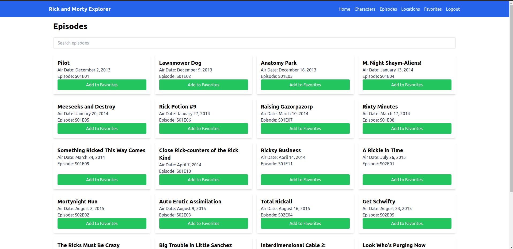

# Rick and Morty Explorer

A full-stack application that allows users to explore characters, episodes, and locations from the Rick and Morty universe. Users can register, log in, and manage their favorite items seamlessly through an intuitive interface. This project integrates a React frontend with an Express.js backend, leveraging the Rick and Morty API for rich data.

---

## Table of Contents

- [Rick and Morty Explorer](#rick-and-morty-explorer)
  - [Table of Contents](#table-of-contents)
  - [Project Overview](#project-overview)
  - [Technologies Used](#technologies-used)
    - [Frontend](#frontend)
    - [Backend](#backend)
    - [External APIs](#external-apis)
  - [Features](#features)
  - [Setup Instructions](#setup-instructions)
    - [Backend Setup](#backend-setup)
    - [ScreenShots](#screenshots)

---

## Project Overview

Rick and Morty Explorer is a web application that provides users with an interactive platform to delve into the vast universe of Rick and Morty. The app allows users to:

- **Browse Characters:** View detailed information about characters, including images, status, species, and more.
- **Explore Episodes:** Discover episodes with information like air date, episode code, and synopsis.
- **Investigate Locations:** Learn about various locations with details such as type and dimension.
- **Manage Favorites:** Authenticate and curate a personalized list of favorite characters, episodes, and locations.

The application emphasizes a seamless user experience with real-time data fetching, state management, and secure authentication mechanisms.

---

## Technologies Used

### Frontend

- **React.js:** A JavaScript library for building user interfaces.
- **React Router:** Handles client-side routing.
- **Axios:** Facilitates HTTP requests to the backend and external APIs.
- **Tailwind CSS:** Provides utility-first CSS styling.
- **Context API:** Manages global state, particularly for authentication.
- **React DevTools:** Assists in debugging and inspecting React components.

### Backend

- **Node.js & Express.js:** Server-side JavaScript runtime and framework.
- **MongoDB & Mongoose:** Database and ODM for data modeling.
- **JSON Web Tokens (JWT):** Implements secure user authentication.
- **CORS:** Manages cross-origin resource sharing.
- **dotenv:** Loads environment variables.
- **bcrypt:** Hashes user passwords for security.

### External APIs

- **Rick and Morty API:** Supplies data about characters, episodes, and locations from the Rick and Morty series.

---

## Features

1. **User Authentication:**
   - **Register:** Create a new account with a username and password.
   - **Login:** Access the application using valid credentials.
   - **Logout:** Securely exit the session.

2. **Explore Data:**
   - **Characters:** Browse through a list of characters with detailed profiles.
   - **Episodes:** Explore episodes with comprehensive information.
   - **Locations:** Investigate various locations featured in the series.

3. **Manage Favorites:**
   - **Add to Favorites:** Bookmark favorite characters, episodes, or locations.
   - **View Favorites:** Access a curated list of favorites in a dedicated section.
   - **Remove from Favorites:** Easily unmark items from favorites.

4. **Responsive Design:**
   - Ensures optimal viewing across devices of various sizes.

5. **Error Handling:**
   - Provides meaningful feedback for failed operations or network issues.

---

## Setup Instructions

### Backend Setup

1. **Clone the Repository:**

   ```bash
   git clone https://github.com/mankal-27/rick-and-morty-explorer.git
   cd rick-and-morty-explorer/backend

### ScreenShots
1. **HOMEPAGE**

2. **CHARACTERPAGE**
 
3. **EPISODEPAGE**
   
4. **LOGINPAGE**
   